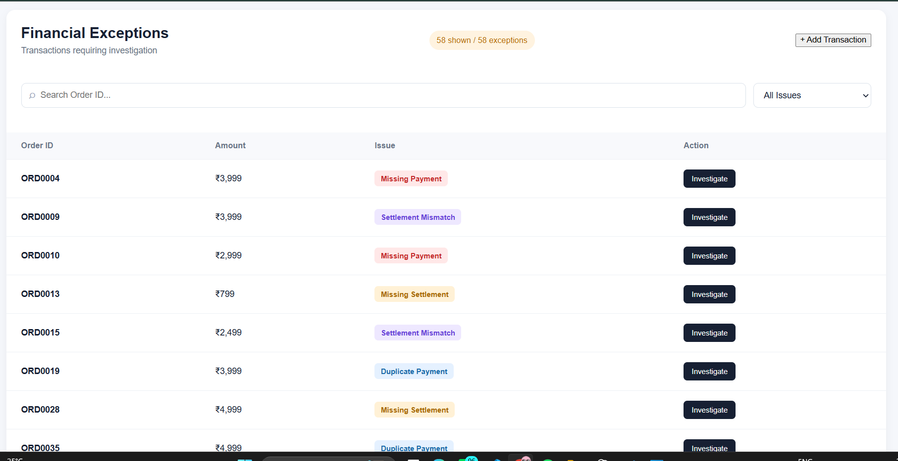
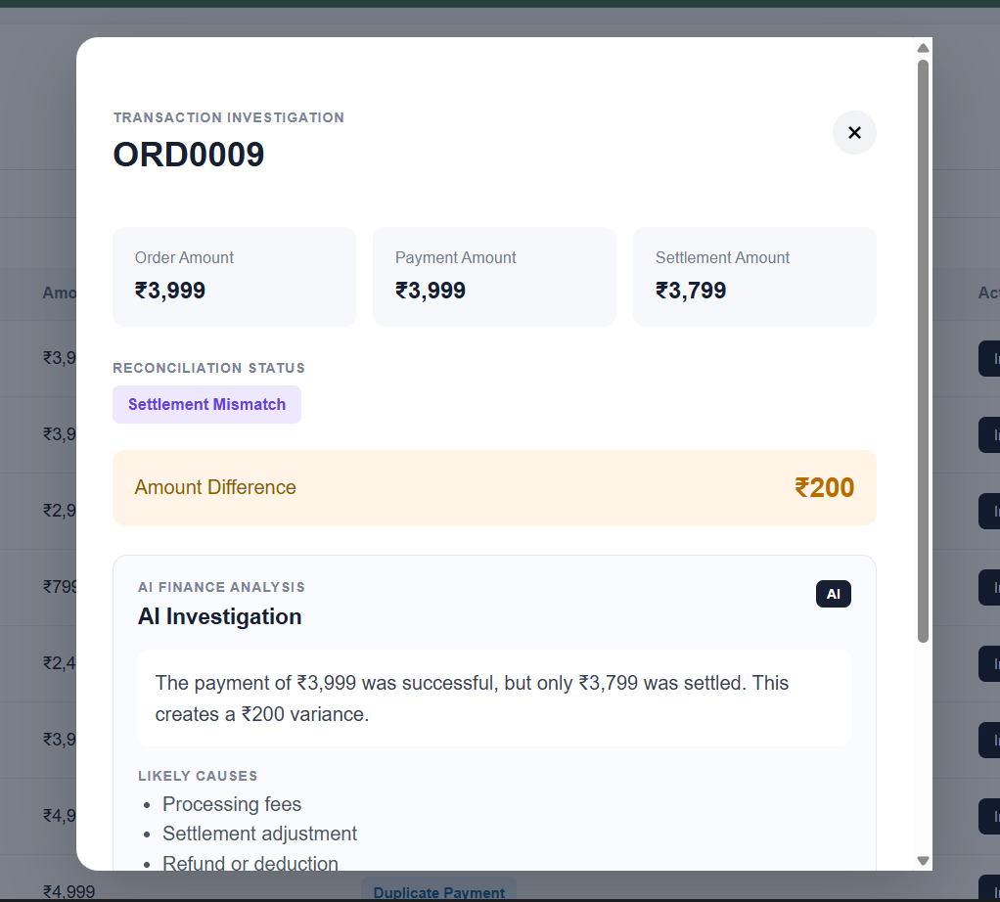
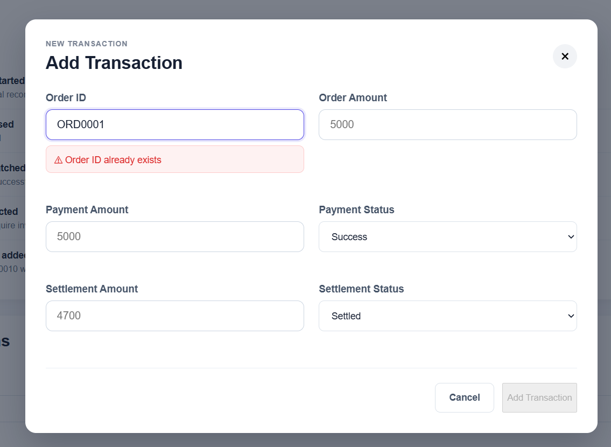
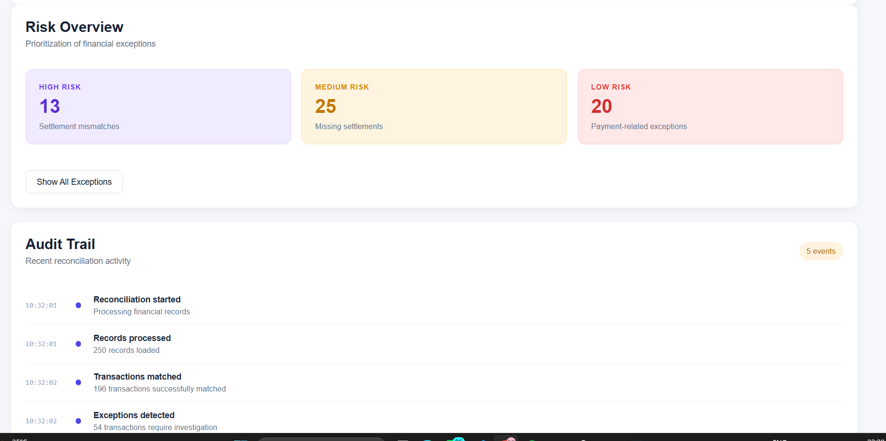

# LedgerLens

## AI-Powered Financial Reconciliation & Exception Investigation Platform

LedgerLens is a full-stack financial reconciliation platform designed to identify, analyze, and investigate transaction discrepancies between orders, payments, and settlements.

The system automatically detects financial exceptions and provides AI-powered insights to help users understand potential causes and recommended actions.

## Features

- Automated transaction reconciliation
- Detection of financial exceptions
- Missing Payment detection
- Missing Settlement detection
- Settlement Mismatch detection
- Duplicate Payment detection
- AI-powered transaction investigation
- AI-generated summaries and likely causes
- Confidence score for investigations
- Recommended actions for financial exceptions
- Interactive dashboard with reconciliation metrics
- Transaction search and filtering
- Detailed transaction investigation view
- Add new transactions through the dashboard
- Real-time Order ID availability validation
- Duplicate Order ID prevention
- Persistent storage for newly added transactions
- Audit trail for transaction activity

## Tech Stack

### Frontend
- React.js
- JavaScript
- CSS
- Vite

### Backend
- FastAPI
- Python
- Pandas
- REST APIs

### AI & Data Processing
- AI-powered transaction analysis
- Rule-based reconciliation logic
- Pandas for financial data processing

## How It Works

Order Data
    │
    ▼
Payment Data
    │
    ▼
Settlement Data
    │
    ▼
Reconciliation Engine
    │
    ▼
Exception Detection
    │
    ▼
AI Investigation
    │
    ▼
Dashboard & Recommended Actions

The reconciliation engine compares transaction records and identifies discrepancies between order, payment, and settlement information.

Detected exceptions can then be investigated using the AI analysis module.

## Exception Types

| Exception           | Description                                              |
| ------------------- | -------------------------------------------------------- |
| Missing Payment     | Order exists but payment information is unavailable      |
| Missing Settlement  | Payment exists but settlement information is unavailable |
| Settlement Mismatch | Payment and settlement amounts do not match              |
| Duplicate Payment   | Multiple payments are detected for a transaction         |

## Dashboard Features

The LedgerLens dashboard provides:

* Total transactions processed
* Number of matched transactions
* Number of exceptions detected
* Match rate
* Exception value
* Exception breakdown
* Search functionality
* Transaction investigation
* Audit trail

## Adding New Transactions

Users can add new transactions directly through the application.

The system:

1. Validates the Order ID
2. Prevents duplicate Order IDs
3. Performs reconciliation
4. Detects transaction exceptions
5. Generates AI analysis
6. Updates dashboard metrics
7. Stores the transaction persistently

New transactions are stored in:

backend/data/new_transactions.json
This ensures that added transactions remain available even after restarting the backend.

## API Endpoints

| Method | Endpoint                  | Description                             |
| ------ | ------------------------- | --------------------------------------- |
| GET    | `/`                       | API health check                        |
| GET    | `/summary`                | Dashboard summary                       |
| GET    | `/exceptions`             | Retrieve transaction exceptions         |
| GET    | `/transaction/{order_id}` | Get transaction details and AI analysis |
| POST   | `/transaction`            | Add a new transaction                   |
| GET    | `/check-order/{order_id}` | Check Order ID availability             |
| GET    | `/metrics`                | Retrieve reconciliation metrics         |
| GET    | `/audit`                  | Retrieve audit trail                    |

## Installation

### Clone the repository

git clone <your-repository-url>
cd LedgerLens

## Backend Setup

Navigate to the backend folder:

cd backend

Install dependencies:

    pip install fastapi uvicorn pandas

Run the backend:

    uvicorn main:app --reload

The API will run at:
http://127.0.0.1:8000

## Frontend Setup

Navigate to the frontend folder:

bash
cd frontend

Install dependencies:

bash
npm install

Run the frontend:

bash
npm run dev

The application will run on:

text
http://localhost:5173

## Screenshots

### Dashboard

### AI Investigation

### Add Transaction

### Audit Trail

## Future Improvements

* Database integration using PostgreSQL or MongoDB
* User authentication and role-based access
* Real-time notifications for critical exceptions
* Advanced ML-based anomaly detection
* Transaction history and analytics
* Export investigation reports as PDF
* Cloud deployment

## Author

**Shreya Ravindrakumar Jirgi**

Computer Science and Engineering Student

## Project Highlights

LedgerLens demonstrates practical implementation of:

* Full-stack web development
* REST API development
* Financial data processing
* Transaction reconciliation
* Exception handling
* AI-assisted investigation
* Persistent data storage
* Interactive dashboard design

